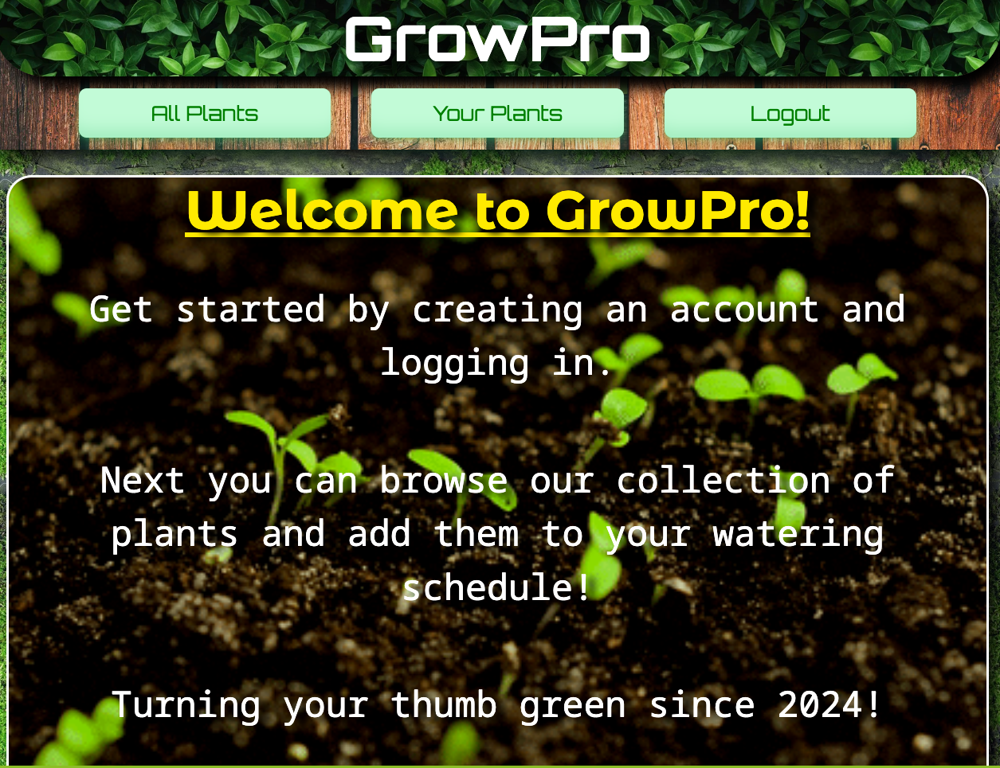

# GrowPro

GrowPro is an application designed to help you manage your plant care schedules efficiently. With GrowPro, you can keep track of your plants and their watering schedules, all in one convenient place.

## Features

- Plant Management: Easily add, view, and manage your plants in one central location.
- Schedule Management: Create, update, and delete watering schedules for each of your plants.
- Modal Interface: Utilizes modal interfaces for a seamless user experience.
- Responsive Design: Designed to work well on both desktop and mobile devices.

## Installation

To use GrowPro locally, follow these steps:

- Clone this repository to your local machine.
- Navigate to the project directory.
- Install dependencies by running npm install.
- Start the backend rails server with rails server.
- Start the development server with npm run dev.
- Open your browser and visit http://localhost:5173 to use the application.

## Usage

- View Plants: Navigate to the "All Plants" section to view a list of all plants.
- View Schedules: Navigate to the "Your Plants" section to view all your plants and watering schedules.
- Add Schedule: Click on a plant to view its details and add a watering schedule.
- Update Schedule: Update watering schedules as needed by editing the schedule details in "Your Plants".
- Delete Schedule: Remove watering schedules for plants that no longer require them.
- Responsive Interface: GrowPro adapts to your device, ensuring a smooth experience whether you're on desktop or mobile.

## Technologies Used

- React: Frontend framework for building user interfaces.
- React Router: Library for routing in React applications.
- Axios: HTTP client for making API requests.
- CSS: Styling to enhance the user interface.
- Node.js: JavaScript runtime environment.

## Contributing

Contributions are welcome! If you'd like to contribute to GrowPro, please fork the repository and submit a pull request with your changes.
